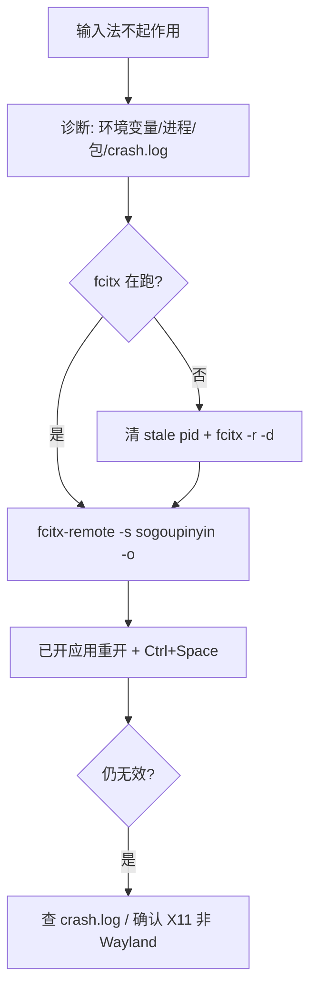

# 逻辑梳理：fcitx / 搜狗输入法规则

| 项 | 内容 |
|----|------|
| 日期 | 2026-08-11 |
| 分片 | `resources/rules.d/85-im.json` |

## 用户说法 → 意图

| 用户说法 | 命中 |
|----------|------|
| 输入法状态 / 搜狗进程 | `im.status` |
| 重启输入法 / 重启 fcitx | `im.fcitx.restart` |
| 输入法不起作用 / sogou not work | `im.notwork` |
| GTK_IM_MODULE / 输入法环境变量 | `im.env.check` |
| 设置 fcitx 环境变量 | `im.env.set` |
| 切换搜狗 / 激活输入法 | `im.switch` |
| 搜狗设置 / 输入法配置 | `im.sogou.config` |
| 输入法崩溃 / crash.log | `im.fcitx.crash` |

## 排查主路径（im.notwork）

## 本机踩坑摘要

1. **根因常是 fcitx 进程消失**（搜狗插件 SIGABRT 后未自启），不是未安装。
2. 环境变量正确但无进程 → 只查 env 会误判；必须 `pgrep fcitx`。
3. 恢复后 **旧窗口** 可能仍不接 IM，需重开应用。
4. `fcitx-sogoupinyinhxm` ABI 报错可忽略；主插件 `fcitx-sogoupinyin` 能加载即可。

## 与其它规则边界

- 不替代通用 `sys.process.*`；本分片关键词偏「输入法 / 搜狗 / fcitx」。
- `im.env.set` 与 `env.path.export` 同属会话级 export，互不覆盖。
