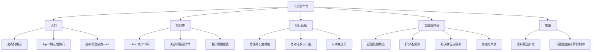
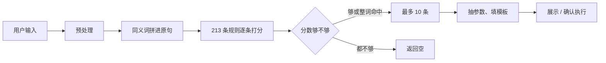
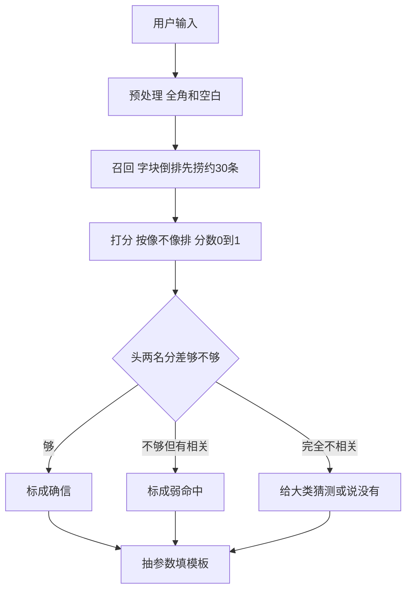
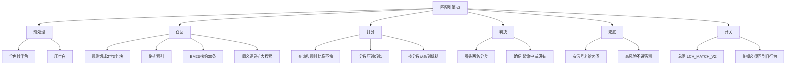

# Linux 中文指令助手 · 匹配管线总体设计

日期：2026-09-29  
读者：产品负责人、自己过一遍方案的人  
写法：先讲全貌，再按模块拆。编号黑话（S4、C-1 之类）收到文末对照表。

本文讲的是：**用户说一句中文，系统怎么找到该执行哪条规则。**  
不讲 Agent 怎么确认、怎么跑 shell；那是匹配之后的事。

配套细账（核验数字、阶段工期）在同目录其它文件。日常先读这一份。

---

## 1. 先看全貌

### 1.1 这个工具干什么

用户输入一句运维口语，例如「重启 nginx」「8080 谁占了」。

系统做三件事：

1. 在约 213 条规则里，找出最像的几条。
2. 从这句话里抽出端口、路径、包名等参数，填进命令模板。
3. 列给用户看；Agent 模式下再确认执行。

规则是 JSON，人写的。每条规则有：意图编号、关键词、风险等级、命令模板。

**现阶段不上大模型、不上句向量。** 理由：要纯离线、包要小、结果要可解释。先把「字面检索 + 打分排序」做对。

### 1.2 一张脑图

### 1.3 一次查询怎么走

**现在（v1）**

问题：召回、打分、卡门槛搅在一起。关键词写得越长、条数越多，分越高。用户换一套说法、不跟关键词撞字，就经常空结果。

**打算做成（v2）**

召回只负责「别漏」。打分才负责「谁排第一」。门槛只看相对差距，不看「加起来有没有 8 分」。

---

## 2. 设计原则（定了就按这个做）

1. **先量后改。** 改匹配代码之前，先有一套不写进产品文档的评测脚本，和一份改代码前就锁死的口语考题。
2. **旧路径先留着。** 用环境变量切新引擎。关掉开关，行为必须和改之前一样。
3. **不靠堆关键词涨分。** 同一句话里，「重启」要比「nginx」更有区分力。
4. **空结果可以有，乱猜不行。** 完全不沾边就说没有。沾边但不稳，可以给候选，但高风险命令不许出现在「我猜你想问」里。
5. **标准库就够。** 倒排、IDF、BM25 用 Python 自带的 `math`、`collections`。不引入 numpy。jieba 可有可无，新打分不依赖它。
6. **不上句向量。** 口语识别率先靠检索和打分抬上去；真卡住了再另立项。

---

## 3. 现状：匹配是怎么算的

### 3.1 规则长什么样

一条规则可以理解成：

| 字段 | 人话 |
|------|------|
| `intent_id` | 意图编号，如 `nginx.restart` |
| `desc` | 一句话说明 |
| `keywords` | 一堆说法，匹配主要靠它们 |
| `weight` | 规则自己的权重，现在会变成打分底分 |
| `risk_level` | low / medium / high / critical，影响确认 |
| 命令 | 一条命令，或一套步骤，或一段脚本 |

磁盘上：`resources/rules.json` 只负责 include，真正的条在 `resources/rules.d/*.json`。大约 213 条、1500 多个关键词。

### 3.2 打分在干什么（人话版）

对每一条规则：

- 关键词在用户这句话里出现了，按**字数长短**加分。词越长，分越高。
- 整句刚好等于某个关键词，再加 8 分。
- 每条规则还先送一点底分：规则权重 × 0.1。
- 213 条加完，按分数和「有没有整词命中」排序，再拿 8 分、4 分去卡。

所以会出现这种怪事：

- 「重启 nginx」明明是重启，排第一的却是「看 nginx 配置」——因为配置那条堆了很多带 `nginx` 的词，字数加起来赢了。
- 用户说「这台机器开了多久」，跟关键词对不上字，总分不到 4，直接空白。

### 3.3 为什么文档里 90% 多，用起来却不准

仓库里有一张语料表，用来回归。表里大多数考题，**就是规则里的关键词原句**。系统等于自己考自己，考分当然高。

换一套不撞关键词的口语（「这台机子开了多久没关过了」），命中率会掉到三成左右，一半还是空。

所以：

- 语料表：**只当护栏**，证明改完没有把老说法改坏。
- 口语留出集：**才当识别率**。题目必须先锁死，再改代码，不能边改边改题。

jieba 也一样：README 写「主路径」，实际是可选。系统 Python 3.8 常常没装；miniconda 3.9 常常有。两条路打分公式还不完全一样。新设计里打分以字块为主，有没有 jieba 不该再走出两套排名。

---

## 4. 目标架构：四段流水线

### 4.1 模块脑图

### 4.2 各层职责（一张表看完）

| 层 | 只做什么 | 不做什么 | 好比 |
|----|----------|----------|------|
| 预处理 | 把字面整理干净 | 不猜意图 | 输入法的半角转换 |
| 召回 | 从 213 条里先捞一批「可能相关」 | 不决定第一名 | 图书馆先按目录抽一架子书 |
| 打分 | 在这批里比谁更像用户那句话 | 不按「加起来有没有 8 分」卡死 | 把抽出来的书按相关度排座 |
| 判决 | 看第一名和第二名差得远不远 | 不负责捞漏网之鱼 | 考官说：过线录取 / 待定 / 没有合适的 |
| 兜底 | 完全没把握时给大类，或诚实空白 | 不许把高危命令塞进「我猜」 | 导购：您是不是要问系统/网络/容器 |

实测过一件关键的事：**只换召回、打分还用老公式，口语命中率和现在一模一样。**  
说明：漏网主要不是「没捞到」，而是「捞到了也过不了老门槛、也排不对」。  
所以真正涨识别率的是**打分 + 判决**。召回是为了又快又干净，不是独立的业绩点。

### 4.3 槽位（第二批，可先不做）

运维口语常常是「动作 + 对象」：重启 + nginx，停掉 + 容器。

第一批用字块打分，已经能修好最刺眼的「重启 nginx 却给出看配置」。  
第二批再给规则标「动作」「对象」，专门治「停的是 nginx，规则却在通用服务那一族」这种跨族问题。

第一批做完，用口语考题里的错题结构决定要不要上第二批：跨族错配占比不到两成，就不做。

---

## 5. 模块说明

下面按「这个模块管什么 / 输入输出 / 注意什么」写。实现时文件名可以再定，责任不要糊。

### 5.1 预处理

**管什么：** 全角数字和标点收成半角，连续空白收成一个空格。

**不管什么：** 不扩展同义词，不删「看看」「帮我」（删了口语味道没了，对字块检索也没必要）。

**注意：** 全拼、错字、截断（例如 `javabanben`）本轮不在这里做拼音纠正。这类题单独记账，不算进主识别率，免得考卷本身考不到。

### 5.2 召回

**管什么：**

- 启动时把每条规则的关键词和描述切成 2 字、3 字块，做成倒排。算一次大约十几毫秒，不必写成文件。
- 查询同样切块，用 BM25 打一个「先相关」的分，取大约 30 条。
- 同义词：用来多搜几路，**不要把整组同义词拼回原句再拿去打分**。拼回去会让无关规则白捡分，还会把「整句等于关键词」的加分冲掉。

**验收看什么：** 正确答案有没有进这 30 条（召回率），查询变慢没有。  
**不看：** 口语第一名准不准——那是打分的事。

### 5.3 打分（重排）

**管什么：** 在召回结果里，比较「用户这句话」和「规则的关键词+描述」像不像。用字块的 IDF 余弦（稀有字块权重大，满世界都是的 `nginx` 权重小）。分数压到 0～1。按分数从高到低排，**谁分高谁排前**，不要再用「有没有整词命中」当第一排序键。

**为什么这能修好招牌问题：** 「配置」出现在很多规则里，权重要低；「重启」「重载」出现得少，权重自然高。不必先给规则贴动词标签。

**注意：** 现在排序把「整词命中」放在分数前面，界面上会出现第 1 名 24.5 分、第 3 名 24.6 分这种难看的表。改成按分排之后，老语料第一名正确率会先掉一截（大约七个百分点），这是还债，不是打分失败。打分公式要先把这段还回来，再谈净提升。

### 5.4 判决

**管什么：** 看第一名分数、以及和和第二名的差距。

大致三档：

| 档 | 含义 | 用户侧 |
|----|------|--------|
| 确信 | 第一名明显更好 | 正常列出，Agent 可按这条走 |
| 弱命中 | 有点像，但不稳 | 列出，提示不太确定 |
| 没有 / 兜底 | 没像样的相关 | 见下一节 |

**不要：** 再用「加起来有没有 8 分」这种绝对线。规则一改关键词，门槛含义就漂。  
**也不要：** 「只要整词命中就放行」——现在这扇门几乎把门槛废了。拆的时候单独做、单独对照，不要跟换公式混在一次提交里。

### 5.5 兜底

**管什么：** 判决觉得没把握时，若打分仍然显示「跟某类东西有点像」，给大类候选（系统、网络、容器……），文案写成「你是不是想问这些」。

**硬规矩：**

- 没有真实相关信号，就空白。不许靠规则自带的底分硬凑四条「国内镜像」。
- `high` / `critical` 风险的规则，不准进猜测列表。
- 猜测档进 Agent 执行前，必须再确认一次。
- 审计里记下当时分数和档位，出事能查是「确信」还是「猜测」。

否定语气（「别停服务」）今天经常检测不到。空白时无所谓；一给猜测，就可能把停服务推到面前。兜底上线前，否定词表和检测窗口要先补。

### 5.6 抽参数和填模板

匹配之后的事，第一批尽量不动：

- 从原句里抽端口、路径、包名等。
- 和会话里 `/set` 的参数合并。
- 按发行版填 `apt` / `yum` 这类占位符。
- 渲染出可执行的命令或步骤。

匹配引擎换了，只要还输出「意图编号 + 分数 + 档位」，后面这套可以继续用。

### 5.7 规则校验（小、必做）

现在加载规则几乎不检查：风险等级写错会悄悄变成 low，等于绕过高风险确认。  
第一批要加加载期检查：写错就失败，不要默默降级。  
动作、对象字段等第二批再标；校验架子可以先立住。

### 5.8 jieba

**不是必装。** 仓库不内嵌 jieba。系统 Python 常常没有，打离线包时构建机有才会打进去。还可以用 `LCH_NO_JIEBA=1` 强关。

新打分以字块为主，有没有 jieba 都走同一套公式。jieba 若在，最多当辅助，不当第二条排名体系。

### 5.9 评测

两套数字永远分开报：

| 套 | 题目从哪来 | 用途 |
|----|------------|------|
| 语料表 | 仓库里那张表，很多就是关键词原句 | 改坏没有 |
| 口语留出集 | 另写、先锁哈希，禁止跟关键词撞字 | 识别率涨没涨 |

口语集再拆成调参用、终验用两半。终验那一半不要拿来逐条改公式。  
错字、全拼单独分类，不算进主识别率。

评测脚本写在本目录 `tools/`，**不要**去跑仓库里那个会改写 `.docs` 命中率文档的旧脚本。

---

## 6. 开关、回滚、安全

### 6.1 总闸

唯一入口仍是现在的「对一批规则打分」那个函数。最前面判断：新引擎开了就走新流水线，否则走旧代码。

关掉总闸，必须和改代码前逐条相同。这是回滚，不靠改 git。

内部还可以有细闸（只关召回、只关判决），给对照实验用。细闸不能乱组合：新分数去撞老的 8 分门槛，会全体变空白。实现时做成「一层层叠上去」，不要做成六个独立开关随便搭配。

### 6.2 安全底线

Agent 确认逻辑先不动。匹配只负责别把错的、险的推到第一位。

兜底额外加两道：高风险不准猜；猜测必须再确认。  
审计补上分数和档位。

---

## 7. 怎么分批落地（人话版）

不按内部阶段号讲，按你能看见的成果讲。

**第一批（必做）**

1. 评测脚本 + 锁死口语考题，记下今天的分数当对照。
2. 写一批「只比谁排前、不比绝对分」的测试，免得改完绿灯却改坏了。
3. 接上总闸、审计字段、显示格式、规则写错就报错。
4. 召回层（变快、少漏；**不要指望这一步口语第一名就飞起来**）。
5. 改成按分数排序（中间语料表分数可能先掉一截，记下来）。
6. 换打分公式（识别率主要涨在这里）。
7. 换判决方式，拆掉「整词就放行」。
8. 兜底和确认，打包用 3.8、3.9 都跑一遍测试。

**第二批（看错题结构再决定）**

给规则标动作、对象，专门打跨族错配。错得不多就不做。

**明确先不做：** 句向量、拼音纠错、把旧匹配代码删掉。旧代码至少留到新引擎默认打开并且稳定之后。

---

## 8. 成功长什么样

第一批结束，同时满足这些才算过：

- 老语料表：第一名正确率不要崩到不可用（允许略低于现在的自证高分，核心常用说法第一名还得对）。
- 口语留出集：第一名、前十名都要比锁题那天明显好；空白率下降，但不是靠乱猜刷掉空白。
- 关掉新引擎，和改之前一样。
- 单次查询不要比现在更慢。
- 高风险命令不会出现在「我猜你想问」。

具体数字以锁题当天测出来的基线为准，不拿旧文档里那份 165 条的 89.7% 当现状。

---

## 9. 和同目录其它文件怎么对照

读累了编号时，用这一张表跳。

| 你想查 | 看哪份 |
|--------|--------|
| 本文：总体设计 | 就是这一份 |
| 最早一页纸方案 | `匹配重建方案.md` |
| 为什么说现在不准 | `识别率与架构分析-2026-09-29.md` |
| 改代码不能踩的红线 | `改造约束与风险核验-v1.md` |
| 分阶段怎么动手（偏工程） | `阶段执行计划-v1.md`（门槛有几处已被核验推翻，以决策记录为准） |
| 计划哪里算错了 | `阶段计划核验-v1.md` |
| **现在按什么做** | `决策记录-v1.md` |
| 评测怎么跑 | `tools/README.md` |

常见编号（只为了能翻细账，日常说话不必用）：

| 编号 | 人话 |
|------|------|
| 语料表 / in-corpus | 自己考自己的那张表 |
| held-out | 锁死的口语考题 |
| 召回层 / 计划里的某一段基建 | 先捞 30 条 |
| 打分层 | 把 30 条排座次 |
| 判决层 | 确信还是猜测 |
| 槽位层 | 第二批：动作 × 对象 |

---

## 10. 这一版故意没写什么

没写每张表的字段清单、没写 BM25 公式展开、没写函数名对照。那些给实现的人看阶段计划和核验文。

你看这一版，主要确认三件事有没有讲清楚：

1. 现在为什么虚高、真正卡在打分和门槛。
2. 新系统四段各自干什么、不干什么。
3. 先做哪一批、什么叫做成。

有哪一块仍绕、或缺一张图，指出章节号，下一版补。
